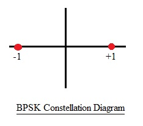
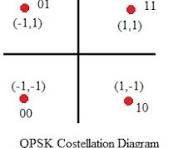

# 📡 Part 1 — What is Modulation? Why Do We Need It?

Raw binary data such as:

```
1 0 1 1 0 1
```

cannot be directly transmitted over an **RF (Radio Frequency) channel**.

This is because digital data exists at **baseband**, while wireless communication systems operate at **high carrier frequencies**.

---

## ❗ Problems with Direct Transmission

### 1️⃣ Baseband Signal

Digital data is a **low-frequency signal** centered near **0 Hz**.

### 2️⃣ RF Communication Requires High Frequency

Most wireless communication systems operate in the **RF spectrum**.

Example:

```
X-Band Frequency Range = 8 GHz – 12 GHz
```

### 3️⃣ Antenna Size Limitation

Antenna size depends on the **wavelength (λ)** of the signal:

```
λ = c / f
```

Where:

- `c` = speed of light  
- `f` = signal frequency  

Low-frequency (baseband) signals produce **very large wavelengths**, which would require **impractically large antennas**.

---

# ✅ Solution — Modulation

**Modulation** is the process of mapping digital information onto a **high-frequency carrier wave**.

Instead of transmitting the raw binary signal, we transmit a **carrier signal whose properties are modified according to the data**.

---
## 📡 Carrier Signal Representation

A sinusoidal carrier signal can be expressed as:

A \times \cos(2\pi f_c t + \phi)

Where:

- **A** → Amplitude of the carrier  
- **fₙ** → Carrier frequency  
- **φ** → Phase of the carrier  
- **t** → Time

---

### 🎛 Carrier Parameters Used in Modulation

```
Carrier:  A × cos(2πfct + φ)
              ↑         ↑
         Amplitude    Phase
           (ASK)       (PSK)
```

| Parameter | Meaning | Modulation Type |
|----------|---------|----------------|
| **Amplitude (A)** | Signal strength of carrier | ASK (Amplitude Shift Keying) |
| **Frequency (fc)** | Carrier oscillation rate | FSK (Frequency Shift Keying) |
| **Phase (φ)** | Phase shift of carrier | PSK (Phase Shift Keying) |

---

### 🎯 Key Idea

Digital modulation works by **changing one of the carrier parameters according to input bits**:

- **Amplitude variation → ASK**
- **Frequency variation → FSK**
- **Phase variation → PSK**

These techniques allow **digital data to be transmitted over high-frequency RF channels efficiently.**
---

## 📊 Basic Concept

```
Binary Data
     ↓
Modulation
     ↓
RF Carrier Signal
     ↓
Wireless Channel
```

---

## 🎯 Key Idea

Modulation allows us to:

- Transmit digital data over RF channels  
- Use practical antenna sizes  
- Efficiently utilize the frequency spectrum  
- Enable long-distance wireless communication

# 📡 Part 2 — BPSK (Binary Phase Shift Keying)

**Binary Phase Shift Keying (BPSK)** is one of the simplest and most robust digital modulation schemes.

In BPSK, the **phase of the carrier signal** is shifted according to the transmitted binary data.
## 🔁 BPSK Phase Mapping

In **Binary Phase Shift Keying (BPSK)**, binary bits are represented by two opposite phases of the carrier signal.

```
Bit '1' → Phase = 0°   →  +cos(2πfct)
Bit '0' → Phase = 180° →  -cos(2πfct)
```

### 📊 Interpretation

| Bit | Phase Shift | Transmitted Signal |
|----|-------------|-------------------|
| 1 | 0° | +cos(2πfct) |
| 0 | 180° | -cos(2πfct) |

This means the carrier waveform is **inverted** whenever the transmitted bit changes.

### 🎯 Key Idea

BPSK encodes digital information by **shifting the phase of the carrier by 180°** between the two symbols.
## 📊 BPSK Constellation Diagram


### ⚖ Pros & Cons of BPSK

| Parameter | BPSK |
|-----------|------|
| **Bits per Symbol** | 1 |
| **Noise Tolerance** | Best (Highest) |
| **Bandwidth Efficiency** | Worst (Lowest) |
| **Typical Use Case** | Very noisy channels, deep-space communication |

---

## 📡 Part 3 — QPSK (Quadrature Phase Shift Keying)

### 📘 Concept

Instead of using **2 phases** like BPSK, **QPSK uses 4 different phase shifts** of the carrier signal.

This allows **2 bits to be transmitted per symbol**, effectively doubling the data rate compared to BPSK.

---


### 🔢 Symbol Mapping

Each symbol represents **2 bits**.

| Bits | I (In-phase) | Q (Quadrature) | Phase |
|-----|--------------|---------------|------|
| 00 | +1 | +1 | 45° |
| 01 | -1 | +1 | 135° |
| 11 | -1 | -1 | 225° |
| 10 | +1 | -1 | 315° |
### 🎯 Key Idea

- Each **symbol represents 2 bits**
- Four phase states are spaced **90° apart**
- This improves **spectral efficiency** compared to BPSK
### 📐 Mathematical Expression

```
s(t) = I × cos(2πf_c t) - Q × sin(2πf_c t)
```

**Where:**

- **I** = cos(φ) → In-phase component  
- **Q** = sin(φ) → Quadrature component  

### 🔢 Symbol Mapping (Normalized Constellation)

```
00 → I = +1/√2 , Q = +1/√2
01 → I = -1/√2 , Q = +1/√2
11 → I = -1/√2 , Q = -1/√2
10 → I = +1/√2 , Q = -1/√2
```

---

### 🧠 Key Insight — IQ Modulation

```
QPSK = BPSK on I path + BPSK on Q path (simultaneously)
```

- **Even bits** → BPSK on **I path** using `cos(2πf_c t)`
- **Odd bits** → BPSK on **Q path** using `sin(2πf_c t)`

Both components are transmitted **at the same time**, which results in:

- **2 bits per symbol**
- **Same bandwidth as BPSK**
- **Double the data rate** ✅
## 📊 QPSK Constellation Diagram



## 📡 Part 4 — 8PSK (8 Phase Shift Keying)

### 📘 Concept

In **8PSK**, the carrier signal can take **8 different phase states**.

Since there are **8 possible symbols**, each symbol can represent:

```
log2(8) = 3 bits
```

Thus, **8PSK carries 3 bits per symbol**, improving spectral efficiency compared to BPSK and QPSK.

---

### 🔢 Tribit to Phase Mapping

```
Tribits → Phase

000 →   0°
001 →  45°
011 →  90°
010 → 135°
110 → 180°
111 → 225°
101 → 270°
100 → 315°
```

---

### 🎯 Key Idea

- **8 phase states**
- **3 bits per symbol**
- Higher **spectral efficiency**
- More **sensitive to noise** than BPSK and QPSK

## 📡 Part 5 — Comparison — BPSK vs QPSK vs 8PSK

| Parameter | BPSK | QPSK | 8PSK |
|-----------|------|------|------|
| **Bits per Symbol** | 1 | 2 | 3 |
| **Number of Phases** | 2 | 4 | 8 |
| **Bandwidth Efficiency** | Low | Medium | High |
| **Noise Tolerance (Eb/No)** | Best | Good | Worst |
| **Minimum Phase Separation** | 180° | 90° | 45° |
| **Used in Project** | S-Band RX | X-Band TX | X-Band TX |

---
## 📡 Part 8 — Common Interview Questions

### ❓ Q: Why is BPSK used for S-Band telecommand and QPSK/8PSK used for X-Band telemetry?

**Answer:**

- **S-Band Telecommand**  
  Commands sent to spacecraft must be received **reliably**, even under poor channel conditions.  
  **BPSK** is used because it has the **highest noise tolerance** and the **lowest probability of error**.

- **X-Band Telemetry**  
  Telemetry data requires **very high data rates** within a **limited bandwidth**.  
  **QPSK and 8PSK** are used because they transmit **multiple bits per symbol**, providing **higher spectral efficiency**.

### 🎯 Key Idea

- **BPSK → Reliability**
- **QPSK / 8PSK → Higher data rate**

## 📡 What is EVM (Error Vector Magnitude)?

**Error Vector Magnitude (EVM)** is a metric used to measure the quality of a digitally modulated signal.

It represents the **distance between the ideal constellation point and the actual received symbol point**.


### 🎯 Key Idea

EVM directly indicates how accurately the transmitter or receiver reproduces the **ideal constellation points**.

Lower EVM means **better modulator implementation and higher communication reliability**.
